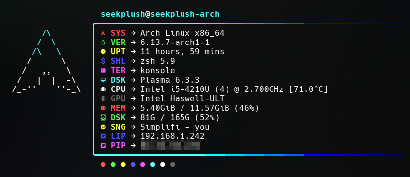

# archfetch
A Neofetch config inspired by "Dotfetch"

## Installation
> [!WARNING]
> Make sure to backup your original config `~/.config/neofetch/config.conf` before installing!\
> Command to backup your config: `mv ~/.config/neofetch/config.conf ~/.config/neofetch/config-backup.conf`

Simply download the `config.conf` and `arch-ascii.txt` files and put them in the directory `~/.config/neofetch`

And because I have absolutely no experience with customizing neofetch (for now), make sure to use the flag `--ascii ~/.config/neofetch/arch-ascii.txt` when executing neofetch so that the ascii art gets printed correctly

And as you might've realized, this config only works best with Arch Linux (which is why I chose the name archfetch), because again, I got no experience with customizing neofetch

But anyways, enjoy :3
